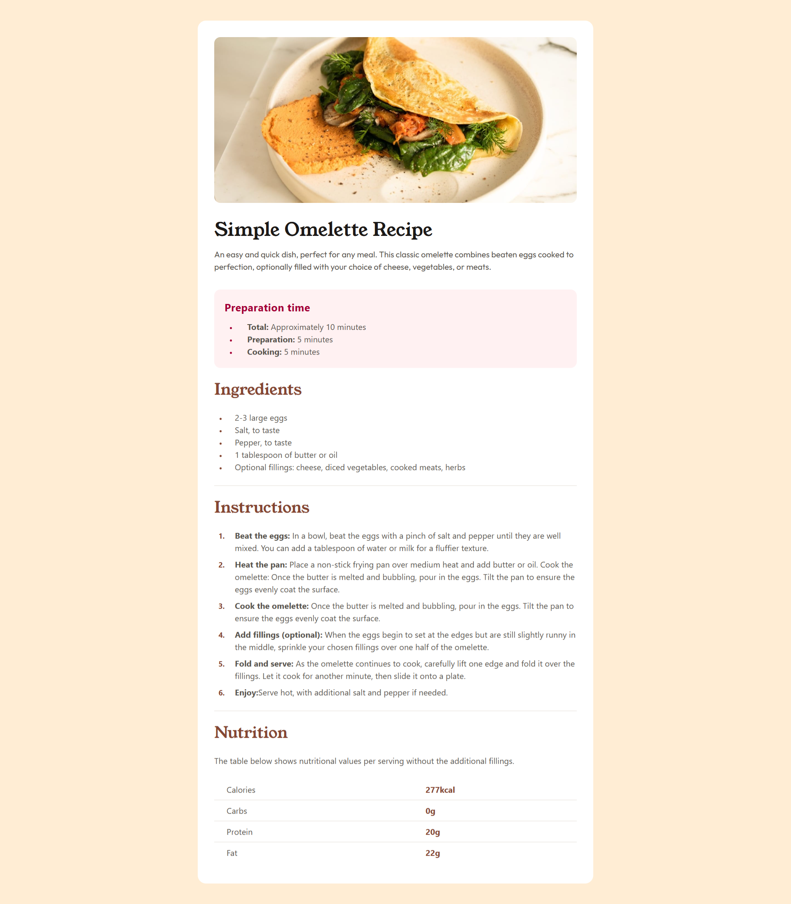

# 🍽️ Recipe Page

Simple web project that showcases a cooking recipe through a clean, responsive, and modern interface. The goal of this project is to practice basic frontend development using HTML, CSS, and Tailwind CSS.

## 📄 Description

This project consists of a static web page that displays a complete recipe, including ingredients, preparation steps, and additional details. Tailwind CSS is used to create a consistent and responsive layout efficiently.

## 🚀 Technologies Used

- HTML5  
- CSS3  
- Tailwind CSS  

## ✨ Features

- Responsive design for different screen sizes  
- Clean and semantic HTML structure  
- Modern UI styled with Tailwind CSS  
- Easy-to-read and well-organized code 

## 🎯 Project Goals

- Practice web layout and styling  
- Learn and apply Tailwind CSS  
- Improve HTML and CSS best practices  

# Frontend Mentor - Recipe page solution

This is a solution to the [Recipe page challenge on Frontend Mentor](https://www.frontendmentor.io/challenges/recipe-page-KiTsR8QQKm). Frontend Mentor challenges help you improve your coding skills by building realistic projects. 

## Screenshot

